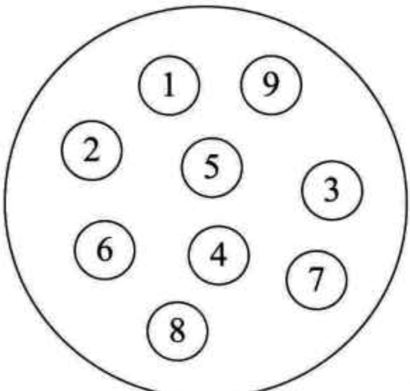
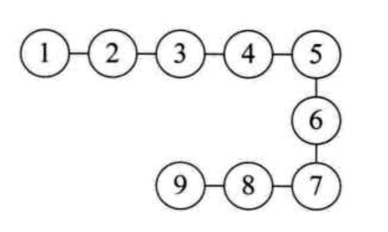
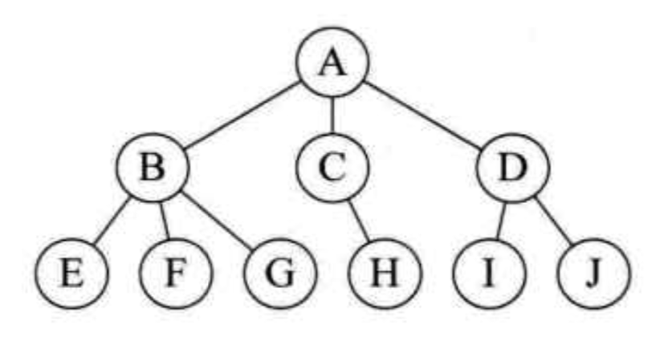
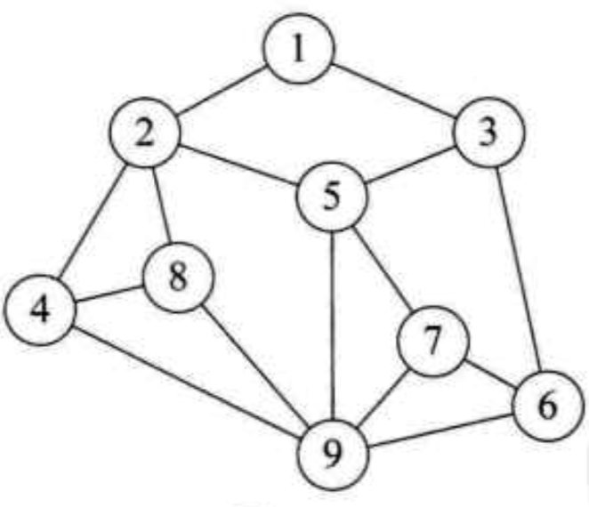
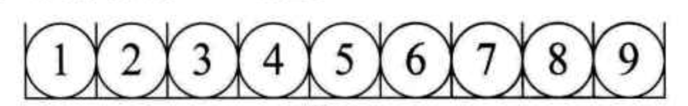
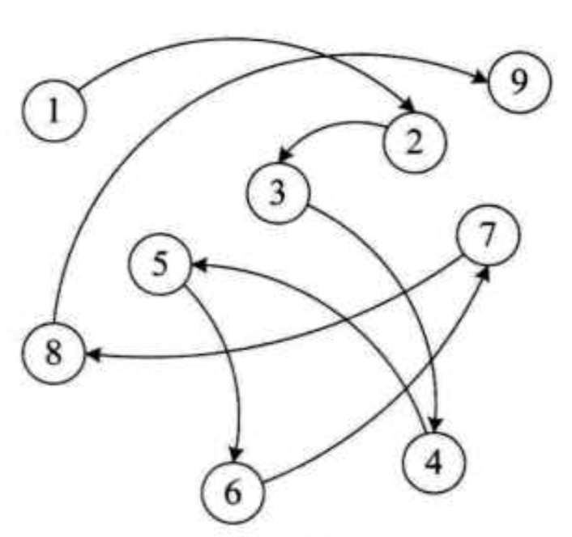

# 数据结构

对于日常生活中，我们描述一件物体，比如：电脑。我们可以知道电脑长什么样，电脑有什么特点，有什么功能。但是电脑或者计算机，它自己怎么知道自己张啥样呢？

所以，我们需要用计算机能懂的形式告知计算机，怎么来描述它自己。我们都知道计算机的内部就是 `0` 和 `1`。之后再扩展出了更多的其他数据类型。

<em>最重要的就是记住：只有两种结构一种是线性（数组），一种是非线性（链表）。其他任何形式的数据结构，都是它们的变形，掌握最基础的，其他都是浮云。</em>

于是乎，就有了下面的一些定义描述。

## 一、数据的组成及概念

数据 -> 数据对象 -> 数据元素 -> 数据项

### 1.1 数据

是描述客观事物的符号，是计算机中可以操作的对象，是能被计算机识别，能够输入给计算机处理的符号集合

核心要点：

- 可输入到计算机中
- 计算机能够进行处理

数据 -> 数据对象 -> 数据元素 -> 数据项

### 1.2 数据对象

是性质相同的数据元素的集合，是数据的子集。

### 1.3 数据元素

是组成数据的、有一定意义的基本单位，在计算机通常作为整体处理。

### 1.4 数据项

数据项是数据不可分割的最小单位。

### 1.5 举例

- 数据：文字数据（数字，字符等），图像数据（图片，视频等），声音数据
- 数据对象：移动终端设备（比如：我们需求是描述移动终端设备相关的信息，需要录入文字数据）
- 数据元素：手机，平板电脑
- 数据项：屏幕大小，电池容量，CPU 型号

## 二、结构

不同数据元素之间不是独立的存在，而是会存在特点的关系。结构就是指：各个组成部分相互搭配和排列的方式。

- 从程序员视角：逻辑结构
- 从计算机视角：物理结构

### 2.1 逻辑结构

这个是我们程序员看到的表象，计算机是不懂这些逻辑结构的，它们只会进行存储数据，具体关系怎样是由我们程序员进行定义的。

- 集合结构：数据结构中的元素之间除了“同属一个集合” 的相互关系外，别无其他关系



- 线性结构：数据结构中的元素存在一对一的相互关系



- 树形结构：数据结构中的元素存在一对多的相互关系



- 图形结构：数据结构中的元素存在多对多的相互关系



### 2.2 物理结构

数据的物理结构是数据结构在计算机中的表示（又称映像），在计算机进行存储表示只有两种结构：线性结构及链式结构。

- 顺序存储结构：按照顺序排队一样，一个紧挨一个地放好，有固定的位置，也是固定的顺序。



- 链式存储结构：与顺序存储结构相反的结构，非线性结构，没有固定位置，也没有固定顺序。



## 三、 数据结构

引出我们的最终定义：数据结构是相互之间存在一种或多种特定关系的数据元素集合。

## 四、抽象数据类型

数据类型：是指一组性质相同的集合及定义在此集合上的一些操作的总称。

通过对数据的分类，大致数据类型可以分为两类：

- 原子类型：是不可再分解的基本类型，包括整型（int），字符型（string）等
- 组合类型：由若干原子类型组合而成，是可以再分解。如：整型数组，字符数组 等

抽象：是指抽出事物具体具有的普遍性的本质。
抽象数据类型（Abstract Data Type - ADT）：是指一个数学模型及定义在该模型上的一组操作。

```js
ADT:
  // ADT 抽象数据类型名
  String
Data:
  // 数据元素之间的逻辑关系定义
  /** 定义：能够将整型，字符型，布尔型等任意数据类型数据，转为字符型数据 */
Operation:
  // 相关具有的函数操作
  constructor(){};
  toString(){};
  ...
```

## 五、算法效率表示（已看完，笔记后补）

- 时间复杂度，主要是指算法运行后执行次数。
- 空间复杂度，注意是指算法运行后需要使用的空间大小，即所占内存空间大小。

## 六、附录

常用来实现数据结构方法有：

### 5.1 数组 (Array)

数组是一种聚合数据类型，它是将具有相同类型的若干变量有序地组织在一起的集合。数组可以说是最基本的数据结构，在各种编程语言中都有对应。一个数组可以分解为多个数组元素，按照数据元素的类型，数组可以分为整型数组、字符型数组、浮点型数组、指针数组和结构数组等。数组还可以有一维、二维以及多维等表现形式。

### 5.2 栈 (Stack)

栈是一种特殊的线性表，它只能在一个表的一个固定端进行数据结点的插入和删除操作。栈按照后进先出的原则来存储数据，也就是说，先插入的数据将被压入栈底，最后插入的数据在栈顶，读出数据时，从栈顶开始逐个读出。栈在汇编语言程序中，经常用于重要数据的现场保护。栈中没有数据时，称为空栈。

### 5.3 队列 (Queue)

队列和栈类似，也是一种特殊的线性表。和栈不同的是，队列只允许在表的一端进行插入操作，而在另一端进行删除操作。一般来说，进行插入操作的一端称为队尾，进行删除操作的一端称为队头。队列中没有元素时，称为空队列。

### 5.4 链表 (Linked List)

链表是一种数据元素按照链式存储结构进行存储的数据结构，这种存储结构具有在物理上存在非连续的特点。链表由一系列数据结点构成，每个数据结点包括数据域和指针域两部分。其中，指针域保存了数据结构中下一个元素存放的地址。链表结构中数据元素的逻辑顺序是通过链表中的指针链接次序来实现的。

### 5.5 树 (Tree)

树是典型的非线性结构，它是包括，2 个结点的有穷集合 K。在树结构中，有且仅有一个根结点，该结点没有前驱结点。在树结构中的其他结点都有且仅有一个前驱结点，而且可以有两个后继结点，m≥0。

### 5.6 图 (Graph)

图是另一种非线性数据结构。在图结构中，数据结点一般称为顶点，而边是顶点的有序偶对。如果两个顶点之间存在一条边，那么就表示这两个顶点具有相邻关系。

### 5.7 堆 (Heap)

堆是一种特殊的树形数据结构，一般讨论的堆都是二叉堆。堆的特点是根结点的值是所有结点中最小的或者最大的，并且根结点的两个子树也是一个堆结构。

### 5.8 散列表 (Hash)

散列表源自于散列函数(Hash function)，其思想是如果在结构中存在关键字和 T 相等的记录，那么必定在 F(T)的存储位置可以找到该记录，这样就可以不用进行比较操作而直接取得所查记录。

---

参考书目：

强烈推荐大家去看下面这本书，简单易懂，小白入门级！

- 大话数据结构（第二版） - 程杰
