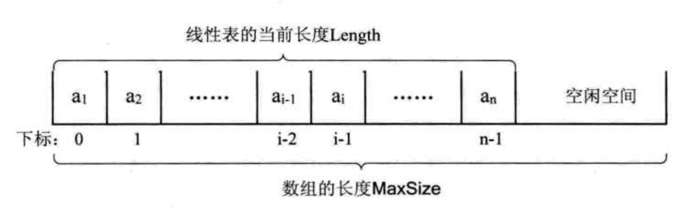

# 线性表

线性表：是零个或多个具有相同特性的数据元素的有限序列。

划重点咯：

1. 相同。 列表里面数据类型都相同，比如：整型数组，字符数组，一旦在列表里出现其他数据类型，就不是线性表。
2. 有限。 是可数的，并不是无限扩展的。
3. 序列。 有顺序的排列，如果是多个数据元素，那么处于中间部分的元素，它前面和后面一定是有元素的。

举个栗子：

比如一年的月份有 12 个月，分为四季。那么月份，四季就是线性表，有顺序，且有限。一月后就是二月，春季后面就是夏季，不可能出现其他的情况，它们的前后都是一对一的关系。

## 定义线性表

之前我们学过如何定义一个抽象数据类型（ADT）, 现在我们就按照之前的模板定义一个抽象数据类型。

我使用的是 `TypeScript` 的表示方法：

```js
ADT:
  // ADT 抽象数据类型名
  LinearList
Data:
  // 数据元素之间的逻辑关系定义
  /**
   * 定义：线性表的数据对象集合为 {a1, a2, ..., an}，每个元素类型都为 DataType 。
   * 其中，除了第一个元素 a1, 每一个元素有且仅有一个前驱元素，
   * 除了最后一个元素 an, 每一个元素有且仅有一个后继元素。
   * 数据元素之间是一对一的关系。
   */
Operation:
  // 相关具有的函数操作：创建，增加（插入），删除，查找，清空，获取列表长度
  // 初始化构造器，创建一个空表，返回一个线性表，里面的数据类型都为 DataType
  constructor = (L: LinearList<DataType>) => LinearList<DataType>
  // 在线性表 L 第 idx 位，插入元素 val，不做任何返回（void，表示无任何返回值）
  insert = (L: LinearList<DataType>, idx: number, val: DataType)  => void
  // 获取线性表 L 第 idx 位元素值，并返回其值，值的类型位 DataType
  get = (L: LinearList<DataType>, idx: number) => DataType
  // 在线性表 L 中查找 val 所处位置的索引，并将它的索引返回一个数字（number: 表示返回一个为 number 类型的值，即数字）
  indexOf = (L: LinearList<DataType>, val: DataType) => number
  // 清空线性表 L
  empty = (L: LinearList<DataType>) => void
  // 删除线性表 L 中第 idx 位元素，返回被删除元素的值（DataType，表示返回一个为 DataType 类型的值）
  delete = (L: LinearList<DataType>, idx: number) => DataType
  // 输入线性表 L，返回它的长度（number: 表示返回一个为 number 类型的值，即数字）
  length = (L: LinearList<DataType>) => number
  // Addition:
  // 额外封装操作：判空
  // 线性表是否为空，并返回一个布尔值，如果是空则为 true，非空则返回 false
  isListEmpty = (L: LinearList) => boolean
```

## 如何将线性表存储到计算机中

线性表在计算机中是以顺序存储结构进行存储，它是一段地址连续的存储单元依次存储线性表中数据元素。



那么线性表要存入到计算机中，如何进行存储结构表示呢？请注意这是定义存储空间，不是定义线性链接长啥样。

由于不熟悉 C 语言，去查了下原有定义：

```c
// 定义存储空间大小，比如我们最多打算用 20KB 或者 20 Byte 的空间存储这段线性表，超出部分就不给你存储了。
#define MaxSize 20

// 将 ElemType 命名别名为 int
#define ElemType int

typedef struct {
    ElemType data[MaxSize];
    int length;
}SqList;
```

去翻了下 C 语言的基础语法了解到：

- `typedef` 是将现有类型创建别名，定义易于记忆的类型名

```c
// 给已知数据类型long起个新名字，叫byte_4。
typedef　long　byte_4;
```

- `typedef struct` 相当于将一种结构，命名为另外一种名称。所以上面的代码相当于下面：

```c
struct ElementList {
  ElemType data[MaxSize];
  // 当前被存储的线性表，它的实时长度
  int length;
};
typedef struct ElementList SqList
```

- `ElemType data[MaxSize];` 翻译下就是：

```c
// 定义了一个长度大小为 20 的数组，里面全是 int 类型
int data[20];
```

## 线性表相关方法实现（已看完，笔记后补）

- 线性表的顺序存储结构

  - 初始化

    - 使用数组进行初始化 list
    - 定义数组的最大长度 MAX_SIZE
    - 需要记录当前链表的长度 length

  - 查找操作

    - 查找第 i 个元素值，i >= 1
    - data[i-1]

  - 插入操作

    - 判断插入位置不能是 i < 0 || i > MAX_SIZE
    - 从 第 i 个位置插入元素后，从 i 位置开始依次变更后续元素的下标，均进行 index + 1 操作

  - 删除操作

    - 删除的位置不能是 i < 0 || i > MAX_SIZE
    - 删除第 i 个位置元素后，从 i 位置开始依次变更后续元素的下标，均进行 index - 1 操作
